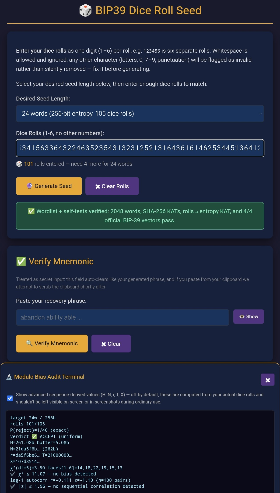
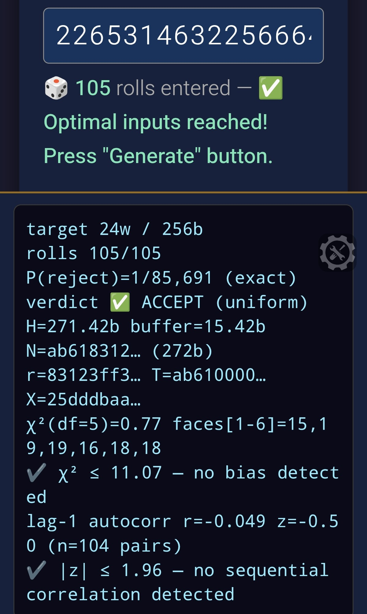

# 🎲 BIP39 Dice Roll Seed Generator

A single-file, offline, cryptographically auditable BIP-39 seed phrase generator driven by physical dice rolls.

Built for security purists: this tool uses **exact rejection sampling** to reduce modulo bias to mathematically **zero**, features on-load Known Answer Tests (KATs) that fail-closed, and includes a live Modulo Bias Audit Terminal — now with statistical die-fairness checks — so you can verify the math yourself.

[](LICENSE)
[]()
<p align="center">

</p>

## 🛡️ Security & Features

- **Zero Modulo Bias (Rejection Sampling):** Instead of bounding the bias, v1.1.4 eliminates it. The base-6 roll integer is mapped to the target $2^b$ space. If the integer falls into the remainder zone ($X \ge T$), the tool refuses to generate and asks you to re-roll.
- **Live Modulo Bias Audit Terminal:** A floating action button (🔬) opens a live audit sheet showing the exact BigInt math (N, R, r, T, X) and the live verdict (✅ ACCEPT or ⛔ REJECT) on every keystroke.
  <p align="center">
  
</p>


##  Live Physical Die-Fairness Diagnostics (Advanced Settings)

Once at least 30 rolls are entered with the "Advanced" toggle enabled, the application analyzes the physical randomness of your dice to ensure the hardware isn't defective, weighted, or rolled predictably.

---

* **Chi-Squared Goodness-of-Fit Test ($\chi^2$)**
  * **What it tests:** Checks whether the observed distribution of die faces ($1$ through $6$) deviates significantly from a fair, uniform probability ($P = \frac{1}{6} \approx 16.67\%$ per face).
  * **Mathematical Formula:** 
    $$\chi^2 = \sum_{i=1}^{k} \frac{(O_i - E_i)^2}{E_i}$$
    Where $k = 6$ represents the faces, $O_i$ is the observed count of face $i$, and $E_i = \frac{N}{6}$ is the expected count for $N$ total rolls.
  * **Threshold:** Evaluated at $5$ degrees of freedom ($\text{df} = k - 1 = 5$). If $\chi^2 \le 11.07$, the distribution is statistically consistent with a fair die at a $95\%$ confidence level ($\alpha = 0.05$).
  * **Terminal Output:** Displays individual face distributions `faces[1-6]=15,19,19,16,18,18` alongside the pass verdict:  
    `✓ χ² ≤ 11.07 – no bias detected`

---

* **Lag-1 Autocorrelation Test**
  * **What it tests:** Detects sequential patterns or physical habits between consecutive rolls (e.g., if throwing a $6$ makes rolling a $1$ immediately after more likely due to hand mechanics or rolling style).
  * **Mathematical Formula:** Calculates the sample autocorrelation coefficient ($r$) for a lag of $1$ across $n = N - 1$ consecutive pairs $(X_t, X_{t+1})$:
    $$r = \frac{\sum_{t=1}^{N-1} (X_t - \bar{X})(X_{t+1} - \bar{X})}{\sum_{t=1}^{N} (X_t - \bar{X})^2}$$
    The test then converts $r$ into a standardized normal $Z$-score to measure significance:
    $$Z = r \sqrt{N - 1}$$
  * **Threshold:** If $|Z| \le 1.96$, there is no statistically significant sequential correlation at the $95\%$ confidence interval ($\alpha = 0.05$).
  * **Terminal Output:** Displays the raw correlation value and $Z$-score (e.g., `lag-1 autocorr r=-0.049 z=-0.50 (n=104 pairs)`) alongside the pass verdict:  
    `✓ |z| ≤ 1.96 – no sequential correlation detected`

---

> **Note:** These statistical tests are strictly **informational diagnostics** regarding the physical quality of your dice. The underlying cryptographic rejection sampling (**Zero Modulo Bias**) operates independently to guarantee mathematical uniformity regardless of diagnostic outcomes.

---

- **On-Load Self-Tests (Fail-Closed):** Every page load verifies the SHA-256 implementation, the official BIP-39 wordlist hash, the roll-to-entropy packing, and 4 official BIP-39 test vectors. If any test fails, the Generate button is disabled.
- **Enhanced Entropy Buffers:** Minimum roll requirements have been increased by +1 across all tiers to maximize the cryptographic safety margin:
  * **12 words:** 55 rolls (~142 bits raw)
  * **15 words:** 66 rolls (~170 bits raw)
  * **18 words:** 79 rolls (~204 bits raw)
  * **21 words:** 92 rolls (~238 bits raw)
  * **24 words:** 105 rolls (~271 bits raw)
- **Memory Wipe:** A dedicated Hard Reset button explicitly nullifies closure-scoped variables and clears the DOM.
- **Mobile-First & Desktop-Ready:** Responsive bottom sheets, collapsible status pills, and native numeric keypads for phones; centered audit cards for desktops.

## 📦 Verification

To ensure the file you downloaded hasn't been tampered with, verify the SHA-256 checksum.

**Option 1: Sidecar file (Linux/macOS)** Download `index.html.sha256` into the same folder and run:

```
sha256sum -c index.html.sha256
# Expected output: index.html: OK
```

**Option 2: Manual Hash** Hash your local `index.html` file using any trusted SHA-256 tool and compare it against the published hash in `index.html.sha256`.

**Option 3: SSH Signature (strongest — verifies the artifact directly)**
Download `index.html.sig` alongside `index.html`, then verify it against
the signing key published at `github.com/IanMcLo.keys`:

    curl -s https://github.com/IanMcLo.keys | \
      awk '{print "IanMcLo@users.noreply.github.com " $0}' > allowed_signers

    ssh-keygen -Y verify -f allowed_signers \
      -I IanMcLo@users.noreply.github.com -n file \
      -s index.html.sig < index.html

    # Expected output: Good "file" signature for
    # IanMcLo@users.noreply.github.com with ED25519 key
    # SHA256:6D+lcVxQsXH+3QK+x6luF5L7tdjajExZSKGJQuPcqZo

## Provenance & Signed Releases

Release tags (September 2026 onward) are signed with the account SSH
signing key — the same key covers all of IanMcLo's repositories.

Fingerprint (SHA256): `6D+lcVxQsXH+3QK+x6luF5L7tdjajExZSKGJQuPcqZo`

Verify: `git verify-tag <tag> --show-signature`
Full scope & reporting policy: see SECURITY.md.

## 💻 Usage

1. **Air-gap your device:** Disconnect from the internet.
2. Open `index.html` in any modern browser.
3. **Browsers label locally-opened files 'not secure' because there is no TLS certificate — expected, and irrelevant: the tool performs no network activity. Your secrets never traverse a connection. Integrity is established by the SHA-256 sidecar and signed releases; local hygiene (air-gap, auto-clear, clipboard discipline) is your protection, not HTTPS.**
4. Wait for the green "✅ Wordlist + self-tests verified" pill to appear.
5. Select your desired word count (12–24 words).
6. Roll a physical 6-sided die and enter the numbers into the input field.
7. Tap the 🔬 button to watch the live rejection sampling math; enable "Advanced" to also see the live chi-squared and autocorrelation die-fairness checks once you've entered 30+ rolls.
8. Once you hit the target roll count, tap **Generate Seed**.
9. Write down your phrase, tap **Clear / Reset**, and power off the device.

> 🌐 A live demo is available at <https://ianmclo.github.io/bip-39-dice/> for evaluation only. For real seed generation, use the downloaded,
> checksum-verified file on an air-gapped device.

## 📄 License

MIT – use at your own risk. This is security‑critical software.
Review the code, verify the outputs against known test vectors, and **only use on air‑gapped devices**.
