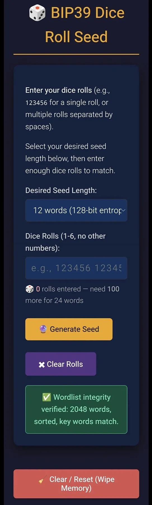
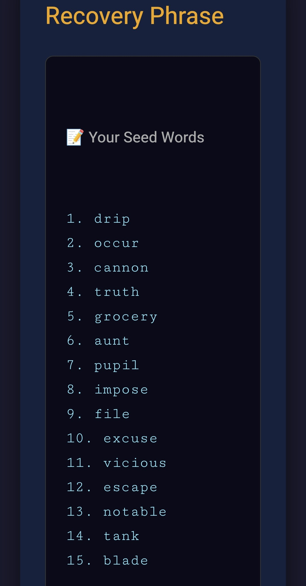
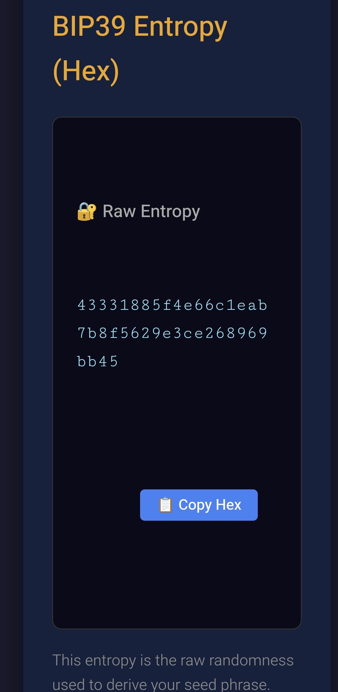
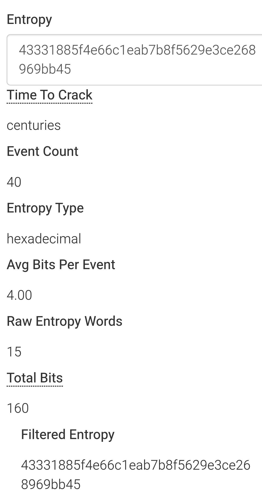

# BIP39 Dice Roll Seed Generator

Generate Bitcoin BIP39 mnemonic seed phrases from physical dice rolls — offline, air‑gapped, and verified.  
A single, self‑contained HTML file that converts dice rolls into BIP39 mnemonics using **standard base‑6 entropy conversion**. Zero dependencies, zero network calls, works entirely in your browser.

---

## 🚀 Quick Start

1. Download `index.html` from this repository.  
2. Disconnect from the internet.  
3. Open the file in your browser.  
4. Select your desired seed length (12, 15, 18, 21, or 24 words).  
5. Roll your dice and enter the results — the live counter shows your progress.  
6. Click **Generate Mnemonic**.

---

## 📸 Screenshots

### 1. Input Dashboard – Enter your dice rolls  
  
*Select your seed length, type dice rolls (space‑separated), and watch the live counter turn green when enough rolls are entered.*

### 2. Generated Seed Words  
  
*Your BIP39 mnemonic appears in a clean, numbered list for safe, easy transcription.*

### 3. Raw Entropy (Hex)  
  
*The pre‑checksum raw entropy is displayed in hexadecimal format for cross‑verification with external tools.*

### 4. Cross‑Verification with Ian Coleman
  
*Paste the raw entropy into [Ian Coleman's BIP39 tool](https://iancoleman.io/bip39/) to confirm the derived mnemonic matches exactly. The stats panel confirms the entropy strength (e.g., 256 bits, centuries to crack) – your dice rolls, your entropy, your keys, verified.*

---

## ✨ Features

- **Single HTML file** – no build step, no dependencies, no external scripts.  
- **Standard base‑6 conversion** – dice rolls treated as a base‑6 number (1→0, 2→1, …, 6→5).
- **Verified against Ian Coleman** – pasting generated seed words produces identical entropy hex, account keys, and addresses.
- **Multiple lengths** – 12, 15, 18, 21, or 24 words.  
- **Live roll counter** – real‑time count with colour‑coded progress.  
- **Wordlist integrity self-test** – cryptographically verifies the embedded BIP39 English wordlist (2048 words) via SHA-256 on every load.

- **Copy‑to‑clipboard** – for both the mnemonic and raw entropy hex.  
- **Hard reset button** – wipes DOM state and nullifies JavaScript variables.  
- **Dark mode UI** – easy on the eyes during long dice‑rolling sessions.

---

## ⚙️ How It Works

1. **Dice rolls → base‑6 number**  
   Each roll (1‑6) is mapped to a digit (0‑5). The full sequence is treated as one large base‑6 integer.

2. **Truncate or pad to entropy size**  
   The integer is converted to bytes and truncated (or zero‑padded) to the required entropy length:
   - 12 words → 128 bits (16 bytes, ≈50 rolls)  
   - 15 words → 160 bits (20 bytes, ≈62 rolls)  
   - 18 words → 192 bits (24 bytes, ≈75 rolls)  
   - 21 words → 224 bits (28 bytes, ≈87 rolls)  
   - 24 words → 256 bits (32 bytes, ≈100 rolls)

3. **Append BIP39 checksum**  
   SHA‑256 of the entropy – first N bits become the checksum.

4. **Map to words**  
   Entropy + checksum split into 11‑bit chunks, each indexing into the BIP39 English wordlist (2048 words).

---

## 🔧 Technical Details

| Parameter          | Value                                                       |
|--------------------|-------------------------------------------------------------|
| Wordlist           | BIP39 English (2048 words, sorted, verified)                |
| Dice mapping       | 1→0, 2→1, 3→2, 4→3, 5→4, 6→5                               |
| Entropy source     | Base‑6 integer from dice rolls                              |
| Checksum           | SHA‑256 (Web Crypto API + pure‑JS fallback)                 |
| Min rolls (12 wds) | ~50                                                         |
| Min rolls (24 wds) | ~100                                                        |
| Bits per roll      | ~2.585 (log₂6)                                              |

---

## 🔒 Security

Use this tool on an **air‑gapped** device only.

- Save the HTML file, disconnect from the internet, then open it.  
- **Never** type real dice rolls into a network‑connected device.  
- Verify your dice are fair, balanced, and physically randomised.  
- The file contains **no external scripts, no analytics, and no network calls**.  
- All computation happens locally in your browser via the Web Crypto API with a **pure‑JS SHA‑256 fallback** for non‑secure contexts (`file://`, HTTP).

---

## ⚠️ Verification & Compatibility

**How to verify your seed is correct:**

1. Generate your mnemonic and copy the **raw entropy hex** (displayed below the seed words).
2. Paste the hex into [Ian Coleman's BIP39 tool](https://iancoleman.io/bip39/).
3. Confirm the **mnemonic words match exactly**.

**Important note on dice-roll compatibility:**

This tool treats the first recorded die roll as the most significant base-6 digit. The full roll sequence is interpreted as a single base-6 integer, then converted to a big-endian hex string padded to the required byte length.
- ✅ Your **seed phrase** and **entropy hex** are always correct and verifiable.
- ✅ Pasting the entropy hex into Ian Coleman's tool will reproduce your seed words.
 - ⚠️ Different tools may convert dice rolls to entropy using different methods. Always verify by comparing the **entropy hex** and resulting mnemonic, not by re-entering dice rolls into other tools. 

**The core security principle:** Your seed phrase is valid and independently verifiable from the displayed entropy hex. Different dice-conversion conventions may produce different entropy from the same rolls, so always verify the entropy hex and resulting mnemonic rather than re-entering the rolls into another tool.

---

## 📝 Changelog

🔗 v1.0.8
- **Security:** moved `currentMnemonic` and `currentEntropy` from `window` global to closure-scoped `let` variables — prevents browser extensions or injected scripts from reading generated seeds
- **Cryptography:** increased minimum dice rolls to reduce modulo bias in base-6 → base-16 conversion — 12 words: 50→52, 15 words: 62→65, 18 words: 75→78, 21 words: 87→91, 24 words: 100→104
- Updated `index.html.sha256` outer file checksum
- Updated UI labels and live roll counter to reflect new exact roll counts
  
### v1.0.7
- Added full cryptographic wordlist integrity verification — on page load the generator SHA-256 hashes the entire 2048-word BIP39 array and compares it against a hard-coded canonical hash. This detects any added, deleted, or misspelled words in addition to the existing length, sortedness, and spot-check validations.
- Updated `index.html.sha256` outer file checksum to match the modified `index.html`.
  
### v1.0.6
- Fixed SHA-256 generation using the browser's native SHA-256 implementation
- Corrected dice-to-entropy conversion using base-6 → base-256 conversion
- Fixed displayed hexadecimal entropy so it matches the generated seed
- Fixed reset behaviour so generated content is cleared without destroying the UI
- Corrected the 18-word requirement from 74 to 75 dice rolls
- Fixed persistent mnemonic/entropy state being retained after reset

### v1.0.5
- Added live roll counter with colour-coded progress bar
- Added word count selector (12/15/18/21/24 words)
- Added entropy statistics panel (time to crack, avg bits per roll)

### v1.0.4
- Added exact entropy validation per word count selection

### v1.0.3
- Added pure-JS SHA-256 fallback for non-secure contexts (`file://`, HTTP)

### v1.0.2
- Fixed wordlist: added missing `huge` and `vanish`, removed erroneous `revolution` — now correctly 2048 words
- Fixed checksum formula: changed from `32 - (bits.length / 32)` to `bits.length / 32` — previously generated invalid BIP39 mnemonics

### v1.0.1
- Initial release

---

## 🙏 Acknowledgements

- [Ian Coleman](https://iancoleman.io/bip39/) for the canonical BIP39 reference implementation  
- [BIP39](https://github.com/bitcoin/bips/blob/master/bip-0039.mediawiki) – Bitcoin Improvement Proposal 39

---

## 📄 License

MIT – use at your own risk. This is security‑critical software.  
Review the code, verify the outputs against known test vectors, and **only use on air‑gapped devices**.

---

> **⚠️ Important Compatibility Note**  
> This tool uses the **base‑6 conversion** method (compatible with Ian Coleman's BIP39 page and Cobo Vault).  
> It is **not** compatible with Coldcard or SeedSigner, which use SHA‑256 of the ASCII dice‑roll string. If you need to verify against those devices, use their official verification tools instead.
